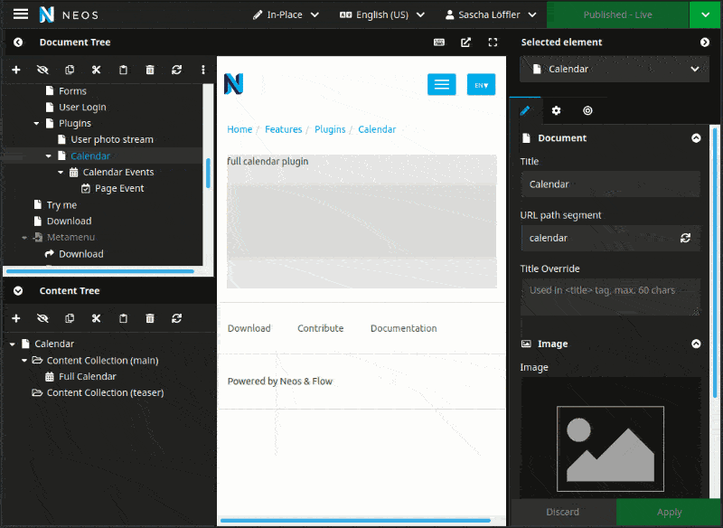

# full-calendar
full calendar implementation package for Flow / Neos CMS

## Installation
Install using Composer:

    composer require lsascha/fullcalendar

Run doctrine migrations:

    ./flow doctrine:migrate

## Features

- Usable with Neos CMS with Plugins + Backend Module or Standalone as Flow Package.
- Multiple Event Sources (from DB, Neos Pages or Google Calendars).
- Easy to use Neos CMS Backend Module with Drag&Drop support for Event Editing.

## Usage
### As standalone (Flow)
As Standalone Flow Package: The default Route is `/calendar.html`.
By default, it shows all Events from all Event Sources.
To limit display to specific sources, add `?sources[]=_IDENTIFIER_` arguments to it.

Event Sources and Events can be added per CLI command. see `./flow help calendar:addsource` and `./flow help calendar:addevent` for help.

### In Neos CMS
Installed into a Neos CMS Installation it adds a Plugin, Page-Types and a Backend Module.
Give the Backend User who should Edit Events the `CalendarAdmin` Role (`Lsascha.FullCalendar:CalendarAdmin`).

The Backend User should then See a new Backend Module named `Calendar` under `Management`.

For Google Calendars as Event Source, you need to set the Google Calendar API Key in your Settings.yaml `Lsascha.FullCalendar.googleCalendarApiKey`
The Google Calendar needs to be Public accessible. See https://fullcalendar.io/docs/google-calendar for more Information.
